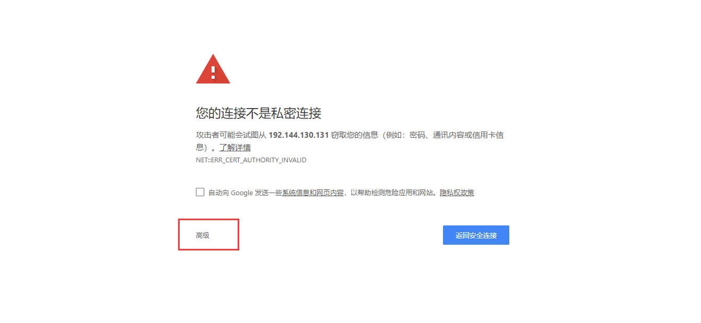
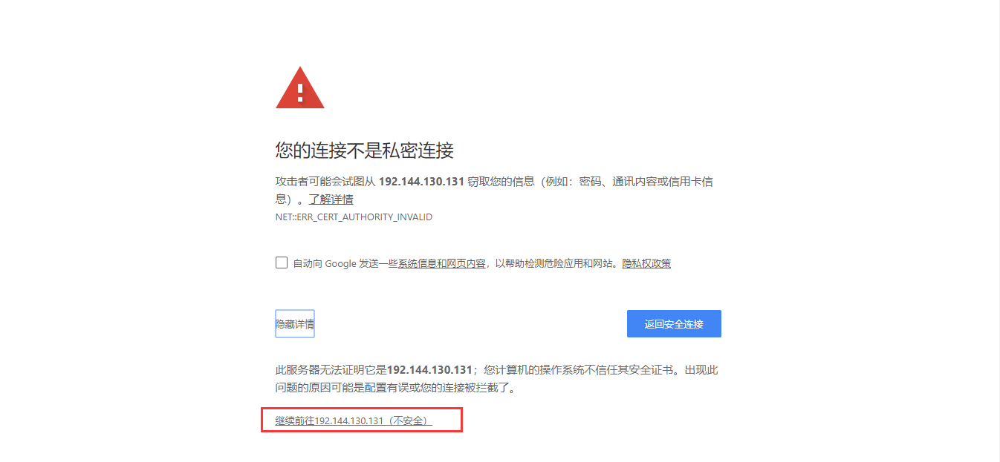

# LoraServer搭建


## 环境准备

- Docker
- docker-compose


## 安装


```shell
git clone https://github.com/brocaar/loraserver-docker.git

cd loraserver-docker

cp -r configuration/lora-app-server /etc/

docker-compose up
```


需要使用https://访问，图片示例：






## 更换Logo
已完成

## 汉化


## 设备与网关的互通
